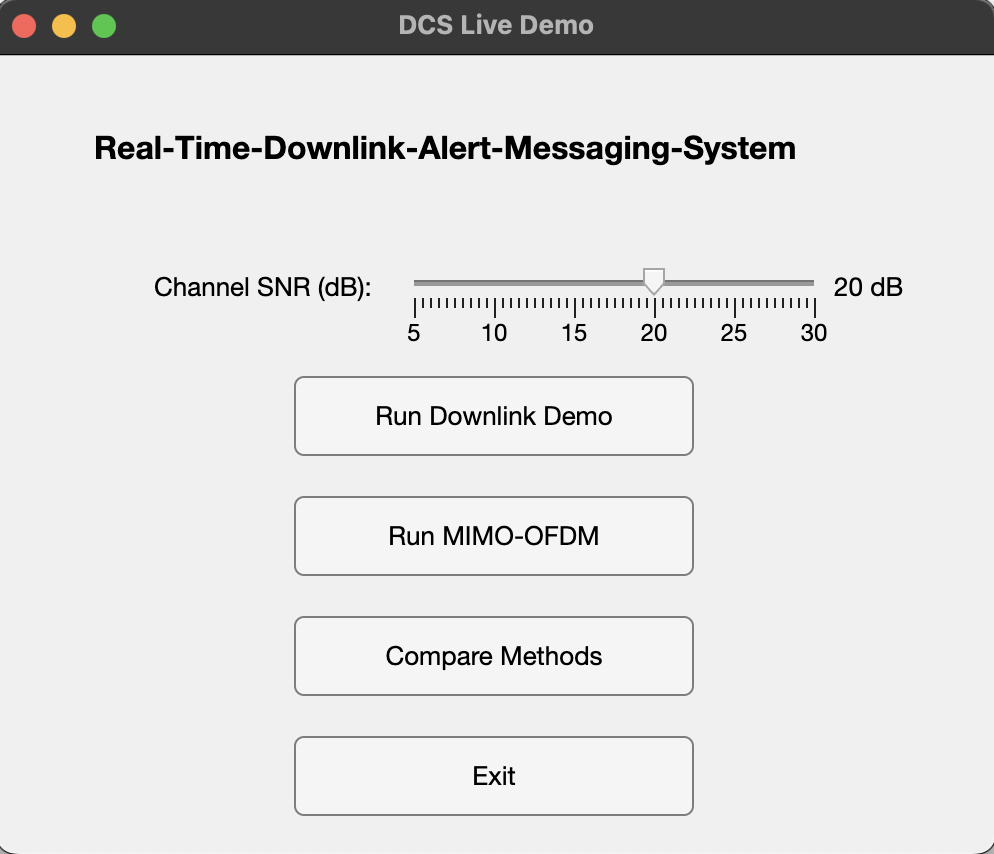
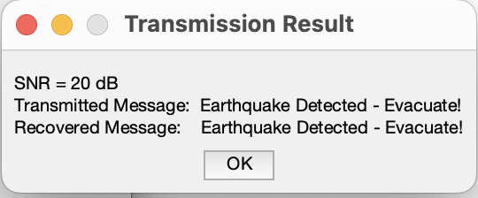
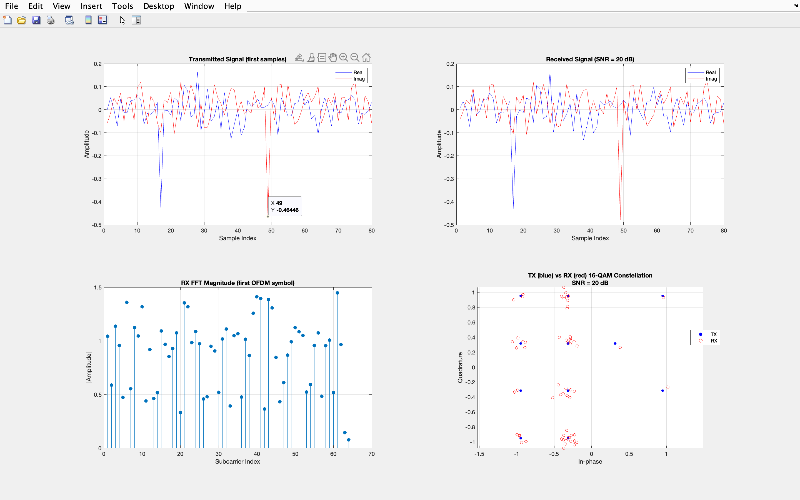
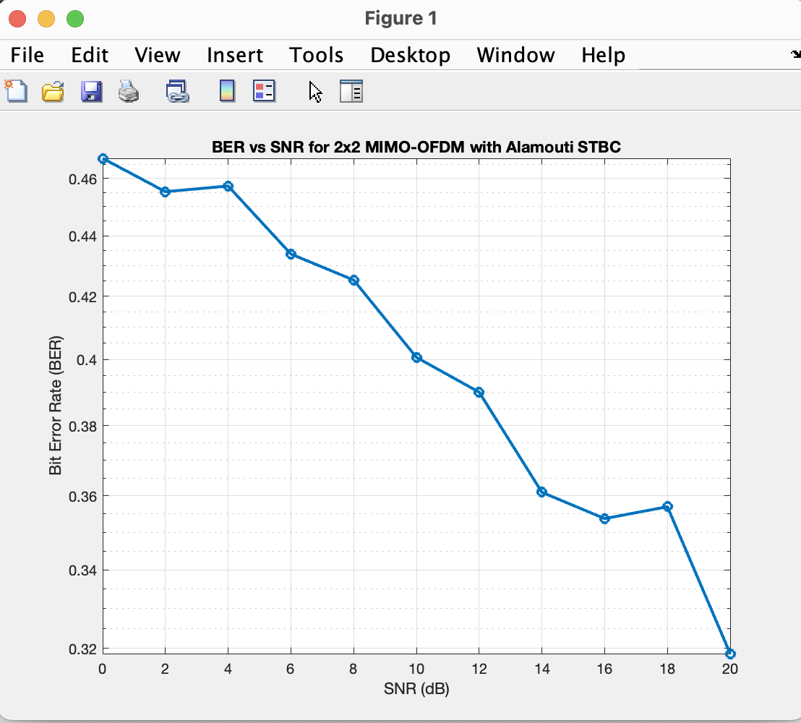
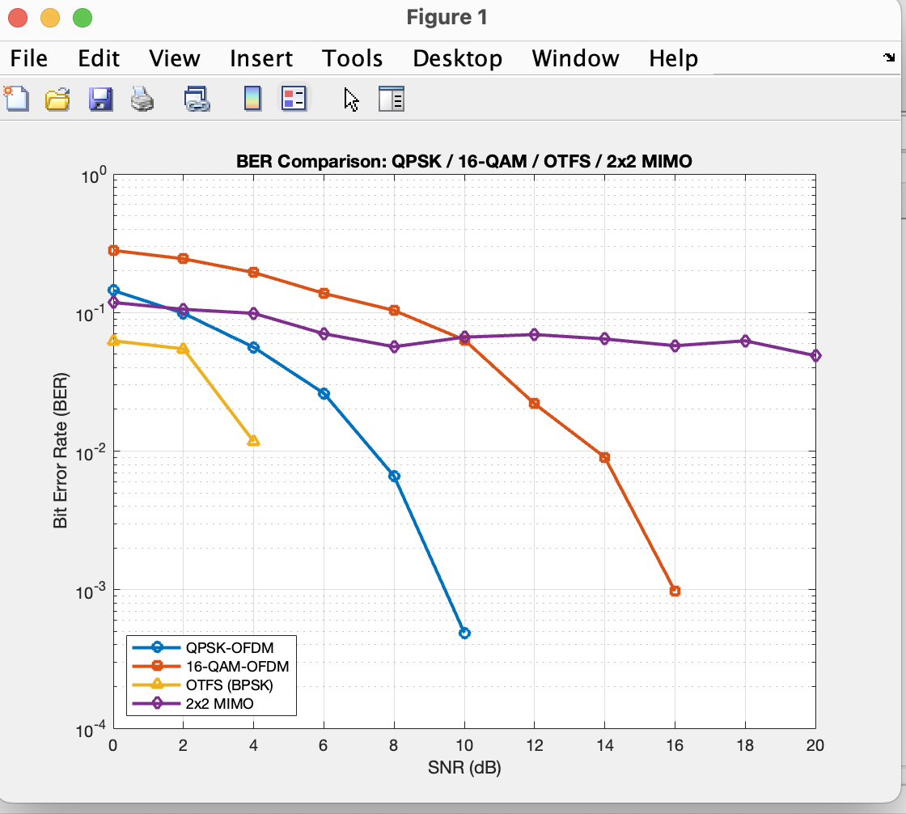

<h1 align="center">📡 Real-Time Downlink Alert Messaging System using 5G NR (MATLAB)</h1>

<p align="center">
  
  
  
  
</p>

---

### 🚀 Overview
This project implements a **5G NR-based downlink alert messaging system** that demonstrates **real-time message transmission and recovery** using **OFDM** and **16-QAM modulation** in MATLAB.  
It showcases how modern wireless systems enable **reliable digital communication** for **smart city and disaster management** applications.

---

### 🧩 System Architecture

📨 Input Message
│
▼
🔡 Binary Mapping (ASCII → Bits)
│
▼
🌀 16-QAM Modulation (4 bits/symbol)
│
▼
📶 OFDM Framing (64-point IFFT + Cyclic Prefix)
│
▼
🌫️ AWGN Channel (Adjustable SNR: 0–25 dB)
│
▼
🔍 FFT Demodulation + CP Removal
│
▼
🎯 16-QAM Demapping (Symbols → Bits)
│
▼
💬 Message Recovery (Bits → Text Output)


---

### ⚙️ Key Features
✅ Real-time message transmission & decoding  
✅ OFDM modulation with 64-point IFFT and cyclic prefix  
✅ 16-QAM signal mapping (4 bits/symbol)  
✅ AWGN channel with adjustable SNR (0–25 dB)  
✅ MATLAB GUI for live downlink visualization  
✅ BER vs SNR performance analysis  
✅ Frequency-domain and constellation visualization  

---

### 💻 GUI Preview
<p align="center">
  
  <br/>
  <em>MATLAB GUI – Real-Time Downlink Alert Messaging System</em>
</p>

---

### 📨 Transmission Result
<p align="center">
  
  <br/>
  <em>Transmission Result – Sent & Recovered Message at 20 dB SNR</em>
</p>

---

### 📶 Downlink Signal Analysis
<p align="center">
  
  <br/>
  <em>Transmitted & Received OFDM Waveforms, FFT Magnitude, and TX vs RX Constellation</em>
</p>

---

### 🧬 MIMO-OFDM Performance (Extended Work)
<p align="center">
  
  <br/>
  <em>BER vs SNR for 2×2 MIMO-OFDM with Alamouti STBC</em>
</p>

---

### 📊 BER Comparison (QPSK, 16-QAM, OTFS, MIMO)
<p align="center">
  
  <br/>
  <em>BER Comparison between QPSK, 16-QAM, OTFS, and 2×2 MIMO Schemes</em>
</p>

---

### 🧠 Conceptual Summary
> The system models a simplified **5G NR downlink physical layer**.  
> The transmitter encodes and modulates an alert message, transmits it through an **AWGN channel**, and the receiver demodulates and reconstructs the original text.  
> As SNR increases, constellation points cluster tightly and BER approaches zero, confirming robust communication performance.

---

### 🧪 How to Run

In MATLAB Command Window:
```matlab
>> dcs_gui_demo
Then:
1. Adjust the SNR slider to vary channel noise (0–25 dB).
2. Click “Run Downlink Demo” to visualize the full transmission chain.
3. Observe waveform, FFT, constellation, and recovered message outputs.
